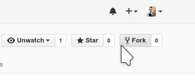
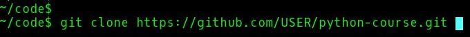
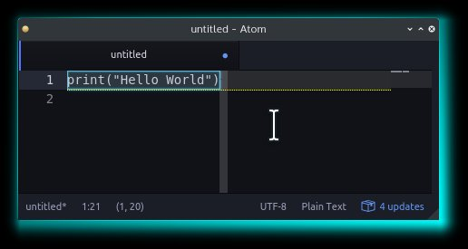
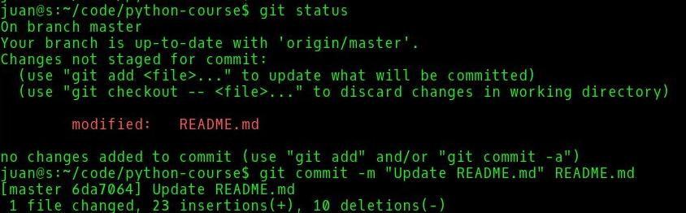
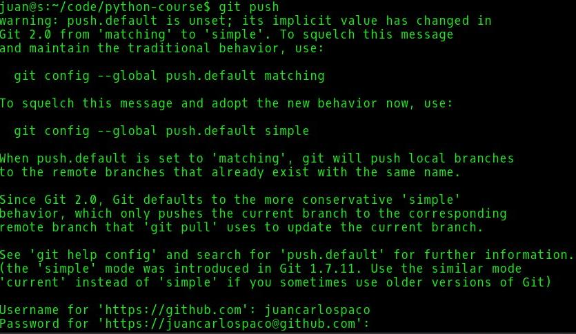
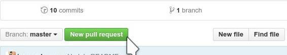
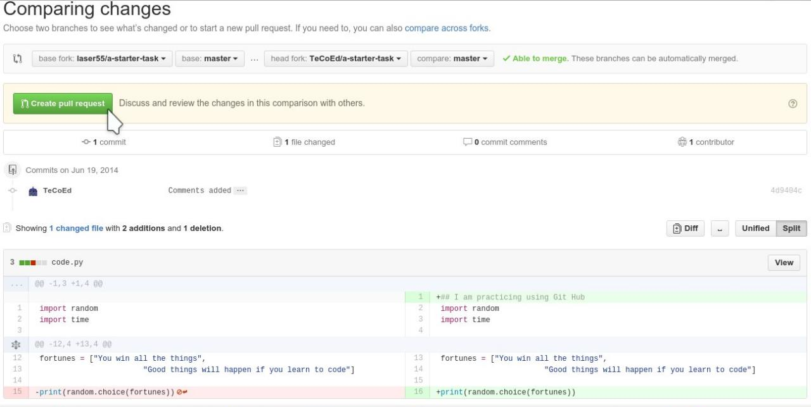
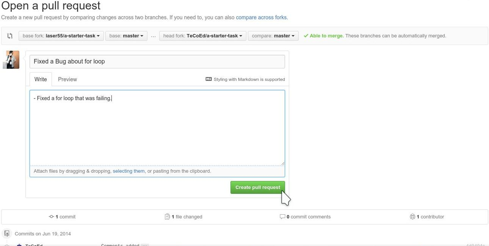

# python-course

<details title="Click here for English Language"><summary><b>EN</b></summary>
Python 3 Course SelfGuided Automatized for GitHub for Classrooms.
</details><details title="Click aca para lenguage Espanol"><summary><b>ES</b></summary>
Curso Python 3 Castellano AutoGuiado Automatizado para GitHub for Classrooms.
</details>


# Requisites


<details title="Click here for English Language"><summary><b>EN</b></summary>
- Linux Operating System (Any Distribution, like Kubuntu, Arch, Fedora, etc. Its Free).
- [GitHub Account](https://github.com/join) (Its Free).
- Git (Depends on your Linux Distrition how to install it, Its Free).
- [Python 3](https://python.org) (Depends on your Linux Distrition how to install it, No Python2, Its Free).
</details><details title="Click aca para lenguage Espanol"><summary><b>ES</b></summary>
- Sistema Operativo Linux (Cualquier Distribucion, como Kubuntu, Arch, Fedora, etc. Es Gratis).
- [Cuenta de Usuario en GitHub](https://github.com/join) (Es Gratis).
- Git (Depende de tu Distribucion Linux como se instala, Es Gratis).
- [Python 3](https://python.org) (Depende de tu Distribucion Linux como se instala, No Python2, Es Gratis).
</details>


# Fork this Repo



<details title="Click here for English Language"><summary><b>EN</b></summary>
Make a copy of this source code repository into your own GitHub account.
A repository is a type of folder on GitHub/Git that handles Versions. 
Making a copy of a repository is called **forking**. 
On the web browser, on the GitHub page of the repo, click on the 'Fork' button (at the top of the screen on the right hand side), and it will automatically copy of everything in this repository will appear under your account. 
When is Forked into your account, you can Edit, Rename, Move, Copy, Delete, Create, Add files and folders.
</details><details title="Click aca para lenguage Espanol"><summary><b>ES</b></summary>
Hace una copia de este repositorio de codigo fuente en tu cuenta de GitHub.
Un repositorio es un tipo de carpeta en GitHub/Git que maneja Versiones. 
Hacer una copia de un repositorio se llama **forking**. 
En el navegador web, en la pagina de GitHub del repo, click en el boton de 'Fork' (arriba a la derecha de la pagina), y esto automaticamente copiara todo en este repositorio y aparecera bajo tu cuenta. 
Cuando se Forkea en tu cuenta, podras Editar, Renombrar, Mover, Copiar, Borrar, Crear, Agregar archivos y carpetas.
</details>


# Clone your Repo



<details title="Click here for English Language"><summary><b>EN</b></summary>
Your repo fork is exact copy of the original but on on your GutHub account, 
now we clone it into your computer to work fixing Errors or Bugs!

*Note: You will need to be connected to the internet in order to clone the repo.*

From a Command Line Terminal, execute the following command to clone the repo on your GitHub account:

   ```
   git clone https://github.com/USER/python-course.git
   ``` 
   *Note that you need to replace 'USER' with your GitHub account username.*

When it finishes the clone of the repo, 
you will see a new directory on your computer with the same contents that the repo.
The Fork will remain accessible from the GitHub web page of your account via web browser.
</details><details title="Click aca para lenguage Espanol"><summary><b>ES</b></summary>
Tu repo Fork es una copia igual al original pero en tu cuenta de GitHub, 
ahora lo clonaremos en tu computadora para trabajar arreglando los Errores o Bugs!

*Nota: Deberas tener conexion a internet para poder clonar el repo.*

Desde una Terminal de Linea de Comandos, ejecuta el siguiente comando para clonar el repo desde tu cuenta de GitHub:

   ```
   git clone https://github.com/USER/python-course.git
   ```
   *Importante cambia 'USER' con TU usuario de GitHub.*

Cuando termine de clonar el repo, en tu computadora tendras una nueva carpeta con lo mismo que tiene el repo.
El Fork quedara accesible desde la pagina de GitHub en tu cuenta via navegador web.
</details>


# Fix Bugs



<details title="Click here for English Language"><summary><b>EN</b></summary>
Explore the repo..., see folders and files..., read the code...
The tasks are divided by folders with numbers,
the lower numbers are easy ones, the higher more complex,
all of them have imperfections that makes them do not work correctly,
choose a folder and start trying to fix it until you make it work.

Edit the code with a text editor, test the code executing it with Python on your computer.

```
python3 file.py
```

when it works correclty and do not return errors save it.
</details><details title="Click aca para lenguage Espanol"><summary><b>ES</b></summary>
Explora el repo..., mira las carpetas y archivos..., lee codigo...
Los trabajos estan divididos en carpetas con numeros, 
siendo los mas bajos relativamente faciles, los mas altos mas complejos,
todos tienen imperfecciones por las cuales no funcionan completamente bien,
elije una carpeta con trabajo y comienza a intentar resolverlo hasta hacerlo funcionar.

Edita el codigo con un editor de texto, prueba el codigo ejecutandolo con python en tu computadora.

```
python3 archivo.py
```

Cuando funcione correctamente y no devuelva error Guardalo.
</details>


# Push to GitHub





<details title="Click here for English Language"><summary><b>EN</b></summary>
Open a Command Line Terminal, change directory to where your updated fixed code file is located.

- Execute `git status` to **see the current Status** of the local copy of your repo.
- Execute `git commit -m "my commit message" file.py` to **Commit your changes** 
*(Note that the commit message acts as a reminder for you or your collaborators about what you have done to the file).*
- Finally, execute `git push` to **Push to GitHub**. 
You will be asked for your GitHub username and password 
*(Passwords are not shown on the Terminal for Security)*, 
if user and password are Ok, it will Upload to your GitHub Repo Fork under your GitHub account,
you can now view the changes via web browser on the page of your repo.
</details><details title="Click aca para lenguage Espanol"><summary><b>ES</b></summary>
Abre una Terminal de Linea de Comandos, cambia de carpeta a la que tiene el codigo actualizado arreglado.

- Ejecuta `git status` para **ver el estado actual** de la copia local de tu repo.
- Ejecuta `git commit -m "mi mensaje de commit" archivo.py` para **Commitear tus cambios**
*(Nota que el mensaje de commit actua como recordatorio para vos o tus colaboradores acerca de que es lo que hiciste en el archivo).*
- Finalmente, ejecuta `git push` para **Pushear a GitHub**.
Te preguntara tu usuario y password de GitHub
*(Passwords no se muestran el la Terminal de Linea de Comandos por seguridad)*,
si el usuario y password estan bien, este subira a tu Repo Fork de GitHub bajo tu cuenta de GitHub,
puedes ver los cambios via navegador web en la pagina de tu repo.
</details>


# Pull Request







<details title="Click here for English Language"><summary><b>EN</b></summary>
On the page of your repo with the fixes already working correctly find and click a **Pull Request** button.
you have to select **from where, to where** send the Pull Request, 
in this case you will select from your master repo *(the one under Your GitHub account with the Fixes)* 
to the original master repo *(the one under My GitHub account without Fixes)*,
Fill in the simple Form from the Pull Request with details of your work, and click Send Pull Request.
</details><details title="Click aca para lenguage Espanol"><summary><b>ES</b></summary>
En la pagina de tu repo con los arreglos ya funcionando correctamente encuentra y clickea el boton de **Pull Request**.
Tenes que elejir **de donde, hacia donde** enviar el Pull request,
en este casi elejir desde tu master repo *(el que esta bajo Tu cuenta de GitHub con los arreglos)*
hacia el original master repo *(el que esta bajo Mi cuanta de GitHub sin arreglos)*,
completa el simple formulario del Pull Request con detalles de tu trabajo, y clickea enviar Pull Request.
</details>
